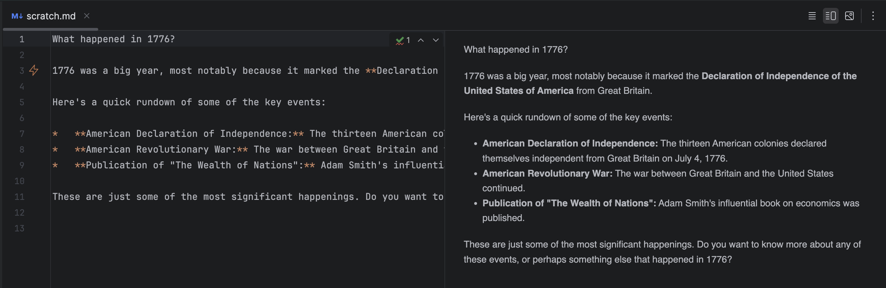

# Inline AI Chat - IntelliJ Plugin

<!-- Plugin description -->
Inline AI Chat embeds OpenRouter model conversations directly in your code editor.

It integrates AI chat functionality into your workflow without requiring a separate popup window.

Ideal for use in .md and .txt files for rapid brainstorming.

## Key Features

- **Streaming:** AI responses are streamed to you in real time.
- **Multiple Models:** Choose from a variety of AI models via OpenRouter.
- **Model Switching:** Quickly swap between models using a handy popup menu.
- **Rate Limit Handling:** Built-in retries handle rate limiting.
- **Customisable System Prompt:** Configure your system prompt.
- **Visual Gutter Annotations:** Identify AI responses by the lightning bolt icon.
<!-- Plugin description end -->

## Installation

1. Open **IntelliJ IDEA** and navigate to **Settings/Preferences → Plugins**.
2. Click **"Browse repositories..."**.
3. Search for **"Inline AI Chat"**.
4. Click **Install** and restart IntelliJ IDEA if necessary.

## Configuration

1. Obtain an API key from [OpenRouter](https://openrouter.ai/).
2. Go to **Settings/Preferences → Tools → Inline AI Chat Settings**.
3. Enter your OpenRouter API key.
4. Select your preferred AI model or add a model.

## Usage

1. Trigger the AI chat using the designated keyboard shortcut or action.
2. Real-time AI responses are streamed directly into your file.

## Requirements

- **IntelliJ IDEA 2024.3** or later.
- A valid **OpenRouter API key**.